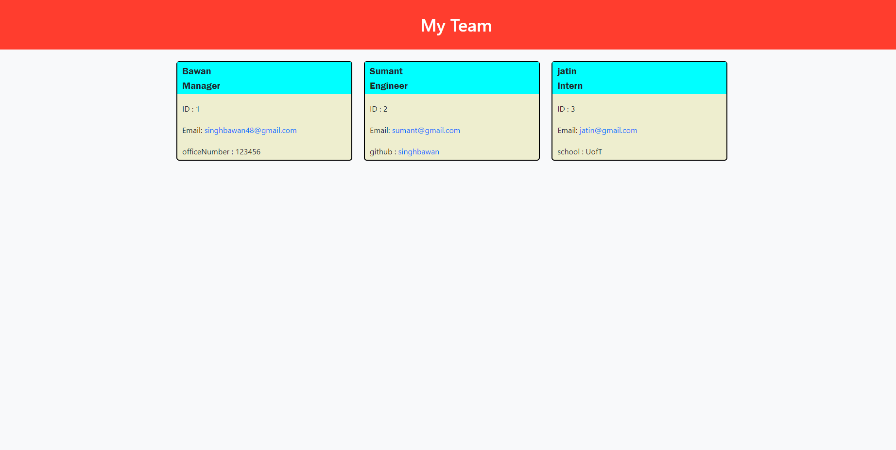

# Team-Profile-Generator

Used to generate a team of employees including manager, engineers and interns.

## Description

The application allows user to enter inputs and add Manager,Engineer and Interns to their team.
The user can enter a variety of data with the provided prompts.
User can have access to mail function and link to the Github repo directly from the HTML webpage generated by the code.

Following is the link to the walkthrough video: https://drive.google.com/file/d/1isNf9wc5sbfYSFTbIMqEQZI8jz7dGNff/view?usp=sharing

## Usage Information
The user can create/add as many Engineer or Intern as per their requirement.

## Screencapture

## Built using
* HTML, CSS, Javascript
* Node.js
* inquirer package
* Jest for testing

## Contribution

Made by Bawan